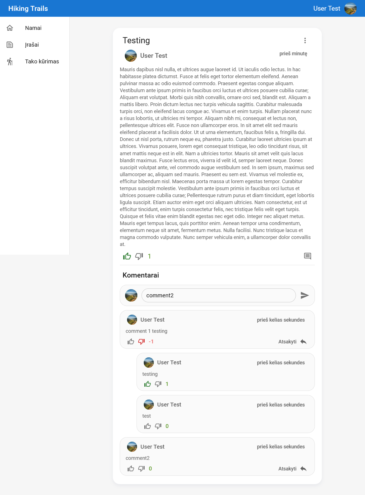
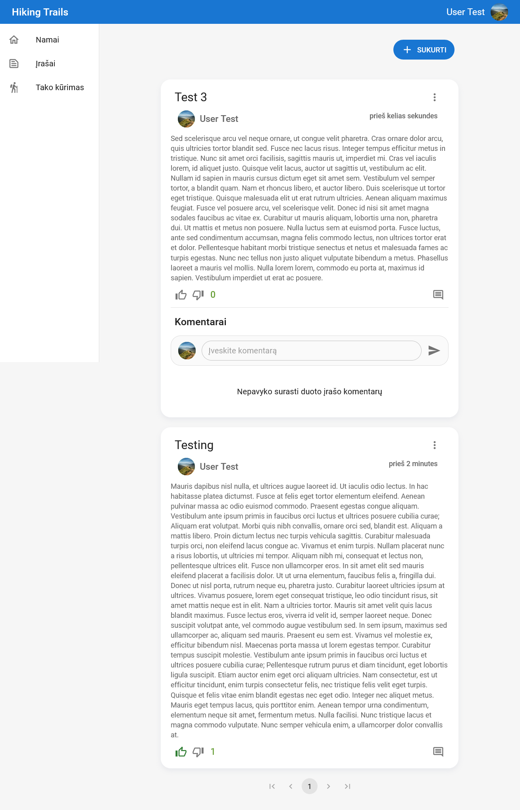
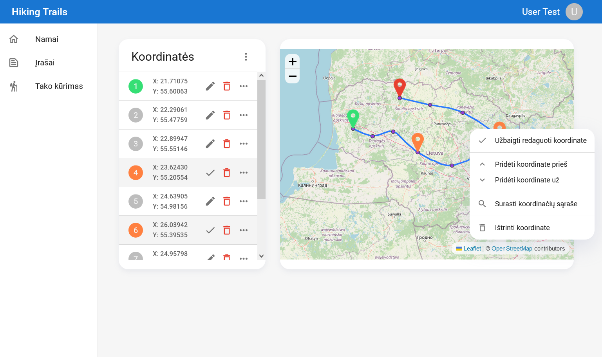
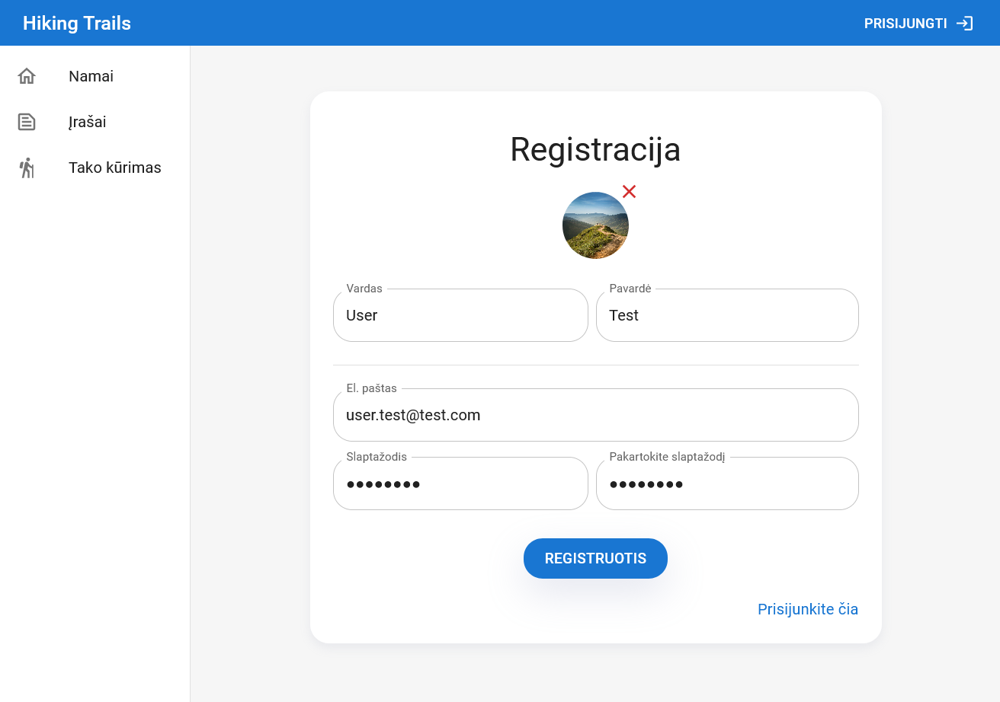
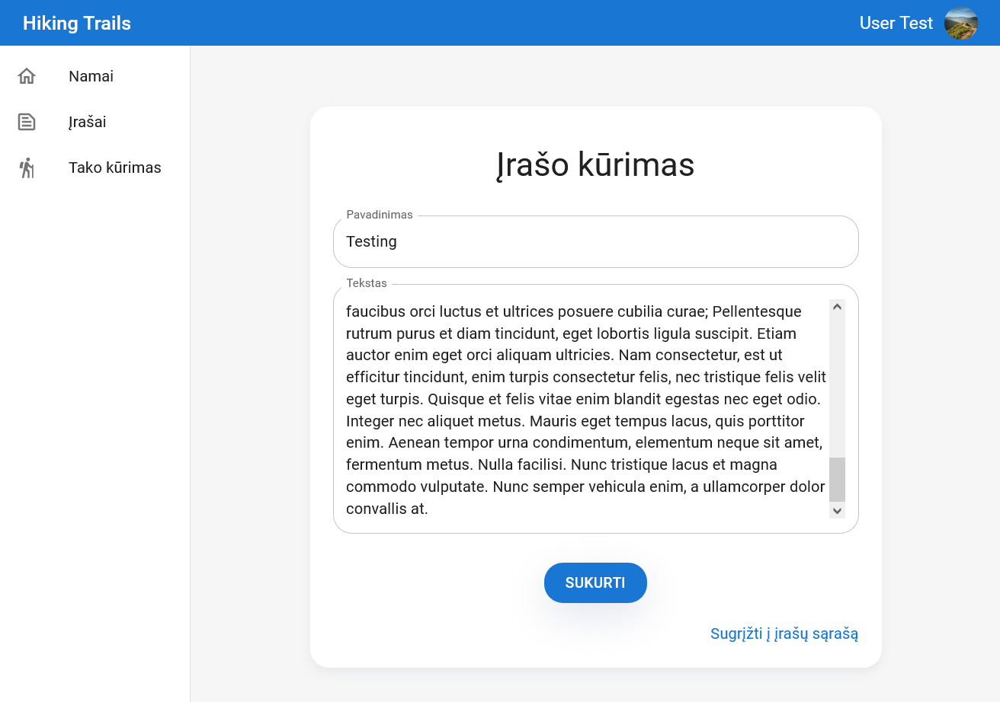

# About

Frontend for a hiking trail social website. The backend can be found [here](https://github.com/aksuram/HikingTrailsApi).

# Project Setup

1. Setup the [backend](https://github.com/aksuram/HikingTrailsApi).

2. Install _node.js_ and _yarn_.

3. Install dependencies using _yarn install_.

4. Change _API_URL_ and _IMG_URL_ in _src\Utilities\config.tsx_.

5. Run the program using _yarn start_.

# Project Images

